<p align="center"></p>

# git-steer-vllm

**git-steer-Ops**: an Ollama model specialized for the **git-steer internals**, part of git-fabric's **fabric-llm** layer (`meta-layer`).

It answers questions about its domain locally, so the fabric only escalates to Claude when it has to. See [fabric-sdk](https://github.com/git-fabric/sdk) for how requests are routed.

| | |
|---|---|
| Base model | `qwen2.5-coder:7b` |
| Context window | 4,096 tokens |
| Temperature | 0.15 |

## Use it

```bash
ollama create git-steer-ops -f Modelfile
ollama run git-steer-ops
```

## What's inside

A single [`Modelfile`](Modelfile): the base model, its sampling parameters, and a system prompt that teaches the model the git-steer internals.

<!-- org-footer -->
---

<p align="center"><sub>Part of <a href="https://github.com/git-fabric">git-fabric</a> · composable fabric apps for Git-native infrastructure · built by <a href="https://github.com/ry-ops">ry-ops</a></sub></p>
